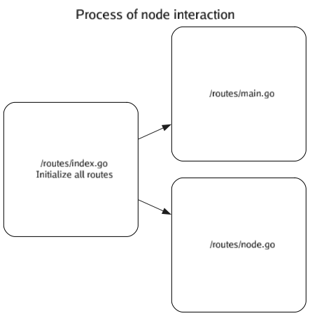

# go_graph_code_docs: Graph Visualization Tool for Code Documentation

[](https://github.com/DaksinWorld/go_graph_code_docs/blob/main/LICENSE)
[](https://goreportcard.com/report/github.com/DaksinWorld/go_graph_code_docs)

## Description

The **go_graph_code_docs** utility is built on Graphviz and designed to facilitate the generation of graph charts for code documentation. It provides a visual representation of how different components of business logic interact across files. The tool outputs graph files in various formats, such as `.gv`, `.png`, and `.svg`.

## Installation

Install the package into your Go project using the following command:

```bash
go get github.com/DaksinWorld/go_graph_code_docs
```

## Example

Consider the following directory structure that you want to document:

```
my-app/     # Root directory.
|- src/          # Source directory.
|- output/       # Directory for generated charts (created automatically)
|- main.go       # Execution file.
```

## Getting Started

Set up the package in your Go application as shown below:

```go
package main

import (
	"github.com/DaksinWorld/go_graph_code_docs"
	"github.com/DaksinWorld/go_graph_code_docs/themes"
	// ...
)

func main() {
	parser := docParser.Parse("./src", "output", "graph")

	parser.AddTitle("Process of Node Interaction")

	parser.AddTheme(themes.LightTheme)

	parser.Generate()
}
```

## Defining Node and Edge Relationships

Assuming you have files in the `src` folder like:

```
src/routes/index.go
src/routes/posts.go
src/routes/users.go
```

The library automatically generates a graph chart to visualize how these files interact. You need to define the connections for each file:

```go
// src/routes/index.go 
package routes

// DOC# @ -> @/routes/posts.go
// DOC# @ -> @/routes/users.go
// DOC## Node = Description: Initialize all routes
```

In this example, the root folder is `./src`, so `@` in `@/routes/index.go` refers to `./src`. The library will replace `@` with `./src`, in result we will have `./src/routes/index.go`,
Which is basically path from main.go (program execution file) to index.go

So we always add prefix `DOC#` and `@` as source node.

Then we provide path as describe above to node using `->`
So in result we have:



### Node and edges attributes

#### Syntax

We use DOC## prefix to show our program, that following line will apply attributes to source node or edge.
Then we specify element that we would like to apply attributes: `Node` or `Edge`.
See all available attributes below

```go
// DOC## Node = Description: Initialize all routes
// DOC## Edge = height: 2

// DOC## [Node or Edge] = [Attribute name]: [Attribute value]
```

#### Attributes
List of available attributes is available [here](https://graphviz.org/doc/info/attrs.html)

#### Custom attributes:

**Only for Nodes!**:

```// DOC## Node = Description: Initialize all routes```

To be added...